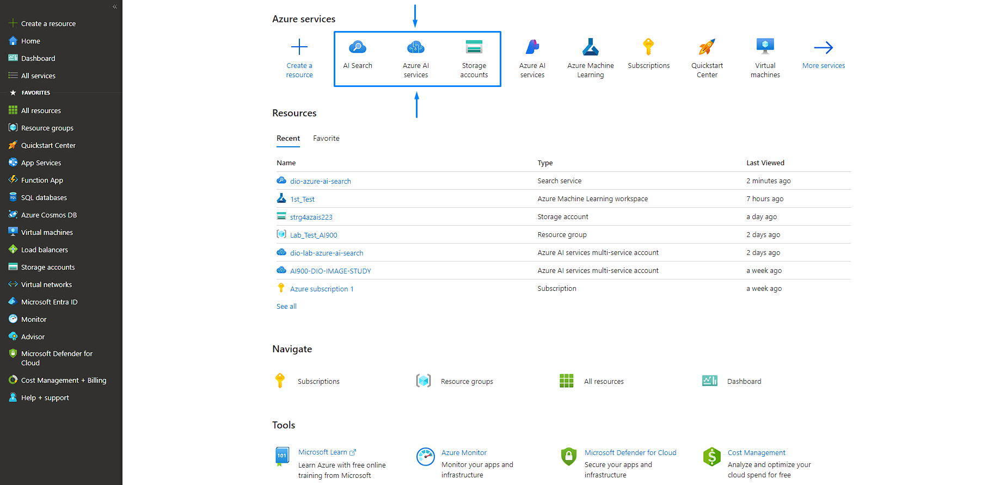

# Azure-Cognitive-Search :cloud:
O Azure Cognitive Search é uma ferramenta desenvolvida pela Microsoft como parte dos serviços da plataforma Azure que permite desenvolvedores construírem e gerenciarem mecanismos de pesquisa para sites e aplicativos, extraindo o máximo possível dos recursos da IA para fornecer a melhor experência para o usuário possível.

# Do que você precisa? :zap:
- Uma conta e inscrição no portal Microsoft Azure;
- Um recurso Azure AI Search;
- Um recurso Azure AI services;
- Uma conta de armazenamento (Storage Account) na plataforma;

# Etapas para utilização da ferramenta :mag_right:
A própria Microsoft disponibiliza, através de um artigo, um passo-a-passo para criação e análise prática de um determinado grupo de dados fornecidos pela própria empresa. Nesse 'case', você irá explorar diversos recursos e funções da ferramenta através de um exemplo prático detalhadamente explicado. Basta seguir as etapas do link disponibilizado a seguir e você terá a possibilidade de aprender um pouco mais sobre a ferramenta.

https://microsoftlearning.github.io/mslearn-ai-fundamentals/Instructions/Labs/11-ai-search.html

# Insights :bulb:
O Azure AI Search é uma ferramenta que possui uma utilidade e eficiência enorme, explorando o melhor que a IA pode oferecer para as análises e pesquisas do usuário. Porém, é importante ressaltar que, durante o seu uso, é de extrema importância apresentar dados não-poluídos e bem organizados. Caso o contrário, as bases de dados fornecidas não vão ter muita utilidade para o uso da ferramenta.

Além disso, vale ressaltar que, por mais que a Microsoft forneça um passo-a-passo para realizar um exemplo prático no Azure Cognitive Search, ainda sim é uma ferramenta de bastante especificidade e necessita de um conhecimento avançado na área pra atingir uma boa proficiência no seu uso. Para isso, é de extrema importância buscar por capacitações e conteúdos de estudo constantemente, de forma a se manter atualizado sobre todos os recursos e opções que a plataforma tem a oferecer.

# Links úteis :link:
https://azure.microsoft.com/pt-br/products/ai-services/ai-search

https://learn.microsoft.com/pt-br/azure/search/search-what-is-azure-search

https://learn.microsoft.com/pt-br/azure/search/
